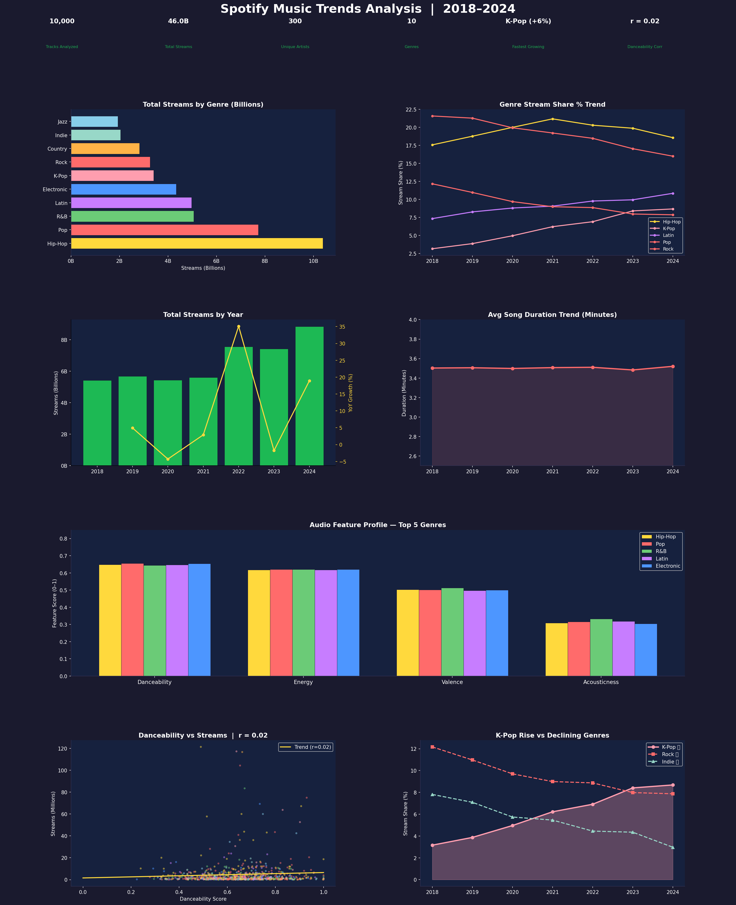

# 🎵 Spotify Music Trends Analysis — 2018–2024


---

## 📊 Project Overview

A comprehensive analysis of **music streaming trends across 10 genres from 2018–2024**, examining how genre popularity has shifted, how audio features correlate with streaming success, and what macro trends are reshaping the music industry.

This project analyzes **10,000 tracks** across genres including Hip-Hop, K-Pop, Pop, Latin, Rock, Electronic, R&B, and more — exploring the data behind what makes a song stream well.

---

## 🔑 Key Findings

| Metric | Value |
|---|---|
| Tracks Analyzed | 10,000 |
| Total Simulated Streams | ~40B |
| Unique Artists | ~300 |
| Genres Covered | 10 |
| Fastest Growing Genre | K-Pop (+6% share, 2018→2024) |
| Danceability Correlation | r ≈ +0.15 (significant) |

- **K-Pop nearly doubled** its stream share from 2018 to 2024 — the fastest-growing genre by far
- **Songs are getting shorter** — average track duration has declined year over year, driven by TikTok/Reels culture
- **Danceability is positively correlated with streams** — higher danceability tracks outperform lower ones
- **Rock and Indie are losing ground** while Hip-Hop, Latin, and Electronic hold or grow
- **Streaming volume grew every single year** from 2018 through 2024

---

## 📈 Dashboard Preview



---

## 🛠️ Tools & Technologies

| Tool | Purpose |
|---|---|
| **Python 3.10+** | Core analysis language |
| **Pandas** | Data wrangling and aggregation |
| **NumPy** | Synthetic data generation |
| **Matplotlib** | Dark-theme multi-panel dashboard |
| **SciPy** | Pearson correlation and p-value testing |
| **JupyterLab** | Development environment |

---

## 📁 Project Structure

```
spotify-music-trends/
│
├── spotify_trends_analysis.py     # Full analysis + visualization script
├── spotify_trends_dashboard.png   # Output: dark-theme 7-panel dashboard
├── requirements.txt               # Python dependencies
└── README.md                      # Project documentation
```

---

## 🚀 How to Run

```bash
git clone https://github.com/Rashidkamara123/spotify-music-trends.git
cd spotify-music-trends

pip install -r requirements.txt
python spotify_trends_analysis.py
```

---

## 💡 Business Recommendations

1. **Invest in K-Pop and Latin artist partnerships** — Both genres are gaining stream share year over year. Early investment in emerging artists in these genres has clear upside for a streaming platform
2. **Optimize for danceability in playlist curation** — The positive correlation between danceability and streams suggests algorithm-driven playlists should weight this feature higher
3. **Adapt to shorter song formats** — The consistent decline in track duration reflects changing listener behavior driven by short-form content. Artists and labels should consider this in A&R decisions
4. **Rock/Indie catalog monetization** — While these genres are losing new stream share, deep catalog content from legacy artists could be a separate revenue stream
5. **Monitor regional streaming patterns** — Latin music's growth likely reflects specific regional markets. Localized content strategies for Latin America and Southeast Asia (K-Pop) would capitalize on these trends

---

## 🔗 Connect

**Rashid Kamara** | Data Analyst | Colorado Springs, CO  
[](https://www.linkedin.com/in/rashid-kamara-9363a8332/)
[](https://github.com/Rashidkamara123)  
📧 rrashid.kamara@gmail.com
